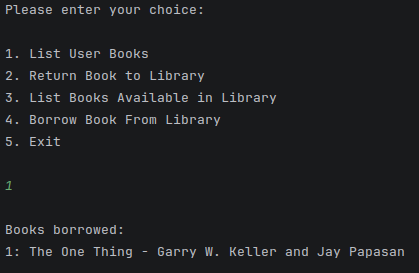
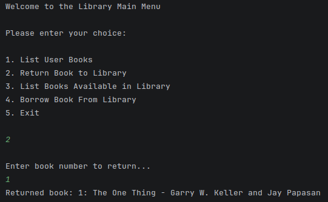

# CXX_Book_Borrowing_System
### A book borrowing system that uses maps to store books that are either in a library or on loan by a user. It allows the user to list all the books available in the library, ones they have on loan currently and allows them to borrow and return books.

# How To Run Program:

### Step 1: Open the Project Folder in your preferred IDE or Text Editor (With preferred compiler).

### Step 2: Ensure that the folder contains these files;

        - Library.cpp
        - MainMenu.cpp
        - Library.h
        - MainMenu.h
        - main.cpp

### Step 3: Run the application!

### Step 4: You will be greeted with the main menu.

### Step 5: Ensure you have the console window as your active window and choose an option by entering numbers 1-5!

# Features:

### Feature 1: List Books Available in Library

### Feature 2: Borrow Books from Library

### Feature 3: View Borrowed Books

### Feature 4: Return Books to the Library

# Final Notes:

### This project was completed closely following a project brief provided by Torrens University Australia. It is a simple book management system designed to utilise maps to gain further understanding of how containers work and the benefit of using specific containers based on the use-case. For example, a map was used for the library system and user books. The key-value pair easily allows books to be identified by a book ID (USN/DOI) and the value stores the title and author. This increases the speed of looking up books, follows the natural standard of identifying books, allows automatic sorting and prevents duplication of stored books.

# Learning Resources:

### cplusplus.com. (2026). Containers - C++ Reference. Cplusplus.com; cplusplus.com. https://cplusplus.com/reference/stl/

### GeeksforGeeks. (2026, April 9). Iterators in C++ STL. GeeksforGeeks; GeeksforGeeks, Sanchhaya Education Private Limited. https://www.geeksforgeeks.org/cpp/iterators-c-stl/

### Morterud, C. (2018, September 7). Dependency Injection in C++. A Dependency Injected; Cody Morterud. https://www.codymorterud.com/design/2018/09/07/dependency-injection-cpp.html

### Welch, S. (2020, March 19). C++ Maps Explained. Udacity; Udacity, Inc. https://www.udacity.com/blog/2020/03/c-maps-explained.html
