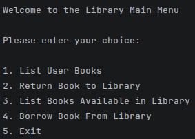
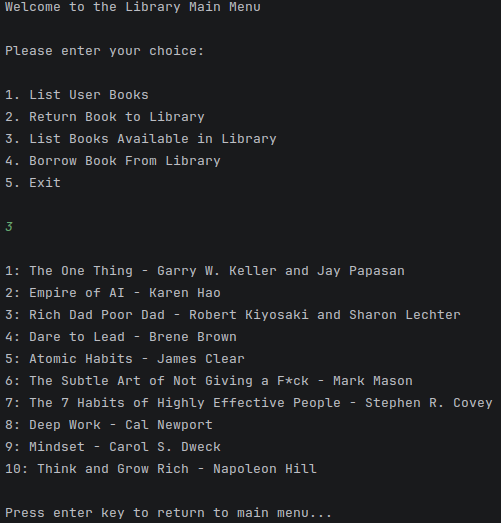
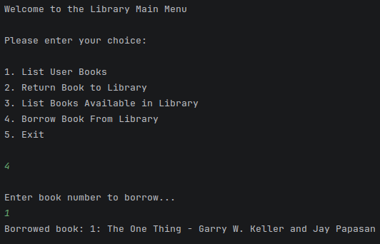

# CXX_Book_Borrowing_System
 A book borrowing system that uses dynamic arrays to store books that are either in a library or on loan by a user. It allows the user to list all the books available in the library, ones they have on loan currently and allows them to borrow and return books.

Step 1: Open the Project Folder in your preferred IDE or Text Editor (With preferred compiler).

Step 2: Ensure that the folder contains these files;

        - Library.cpp
        - MainMenu.cpp
        - Library.h
        - MainMenu.h
        - main.cpp

Step 3: Run the application!

Step 4: You will be greeted with the main menu.

Step 5: Ensure you have the console window as your active window and choose and option by entering numbers 1-5!

Features:

Feature 1: List Books Available in Library

Feature 2: Borrow Books from Library

